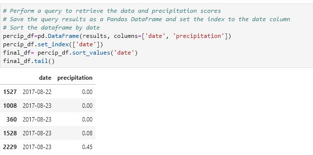
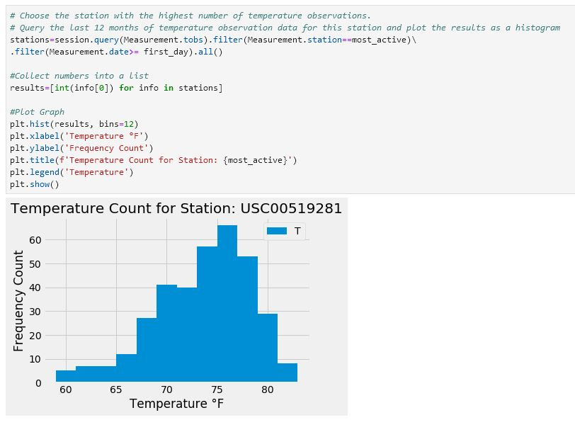

# Surfs Up!

# Purpose
Analyze the climate of Hawaii to determine the best location for a vacation stay.

## Process
Utilizing Python and SQLAlchemy to do basic climate analysis and data exploration of the climate database.  The following analysis will be completed using SQLAlchemy ORM queries, Pandas and Matplotlib.

#### Precipitation Analysis
- Design a query to retrieve the last 12 months of precipitation data
- Select only the date and prcp values
- Load the query results into a Pandas DataFrame and set the index to the date column
- Sort the DataFrame values by date
- Plot the results using the DataFrame plot method
- Use Pandas to print the summary statistics for the precipitation data

#### Station Analysis
- Design a query to calculate the total number of stations
- Design a query to find the most active stations
- List the stations and observation counts in descending order
- Which station has the highest number of observations
- Design a query to retrieve the last 12 months of temperature observation data (TOBS)
- Filter by the station with the highest number of observations
- Plot the results as a histogram with bins=12

# Results
### Precipitation by Station

### Detailed Station Data

